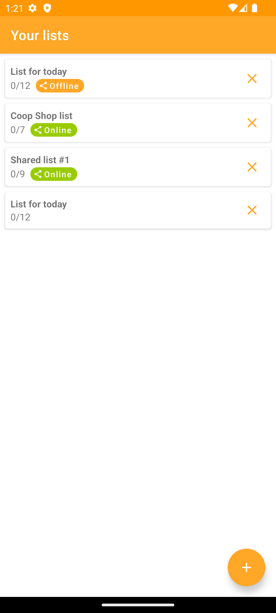
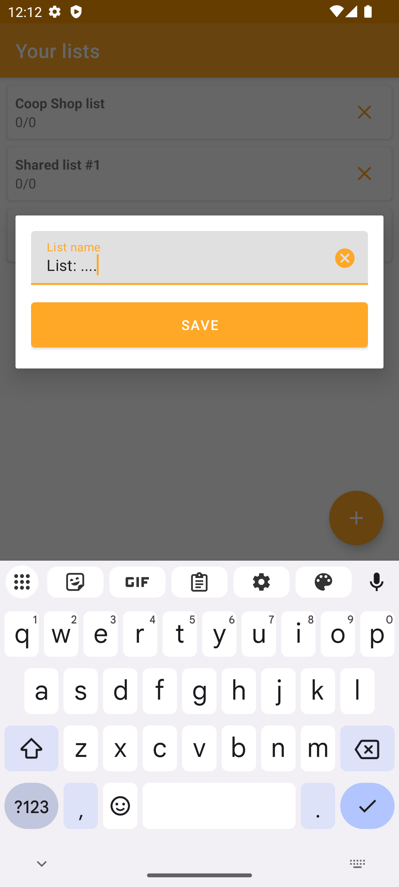
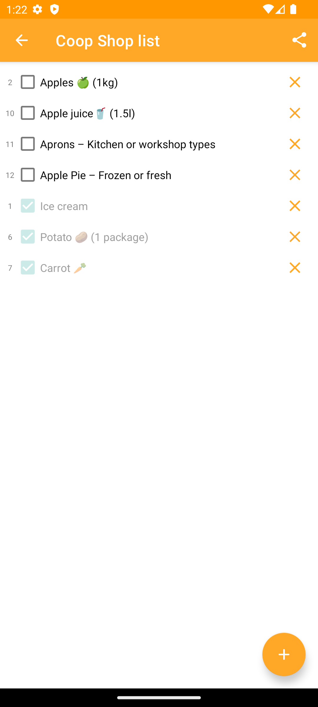
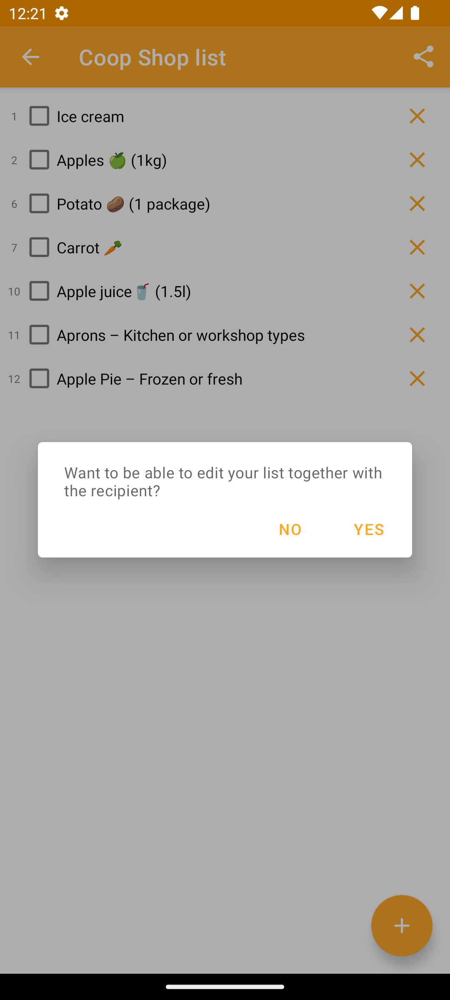
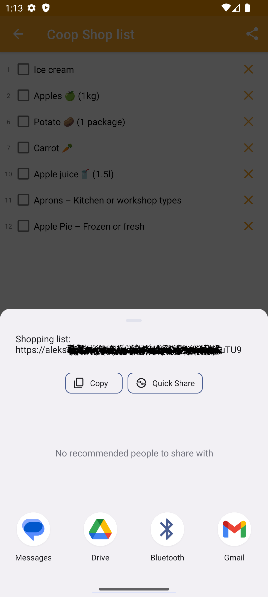
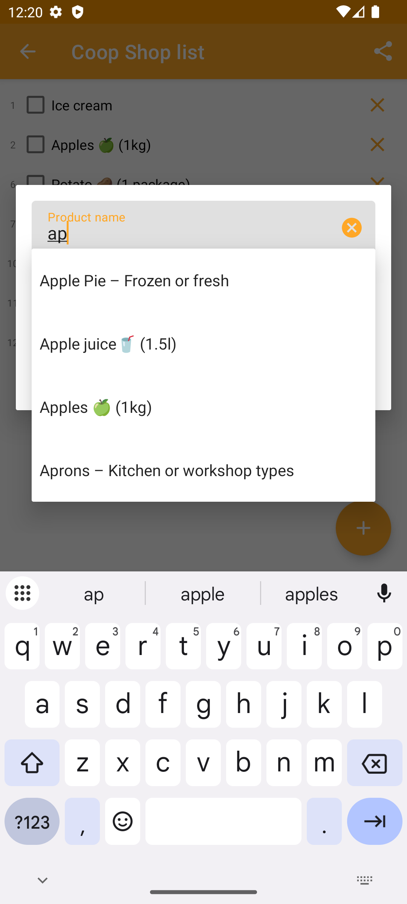
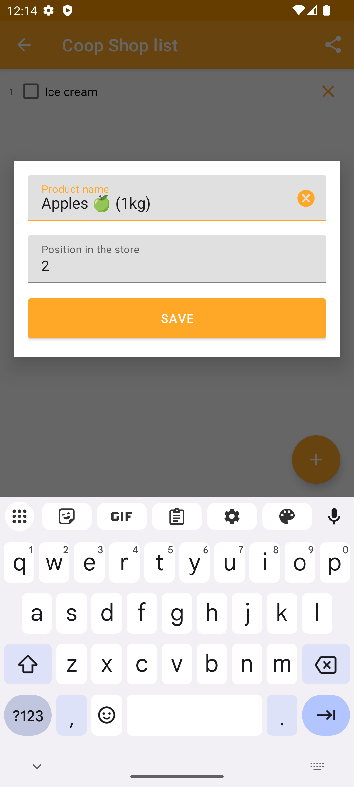

# 🛍️ Purchase-pal

**Purchase-pal** is a minimalistic and efficient Android app for managing shopping lists. Built with speed and user
convenience in mind, it ensures a seamless experience even when the system kills or restarts the app.

---

## ✨ Features

* **🗂️ Organized Shopping Lists**:
  View all your shopping lists on the main screen.
  

    
    
  

* **📝 List Details View**:
  Tap into any list to view and manage its items.
  

    
    
    
  

* **➕ Add Items and Lists**:
  Both main and list screens include an **Add** button for quick input.
  

    
    
  

* **⚡ Smart Resume Behavior**:
  When launching the app, it instantly opens the **last active shopping list**, skipping unnecessary screens. No extra
  taps after a system restart.

---

## 🔗 Sharing Functionality

Purchase-pal supports **two types of sharing**, both using short deep links:

### 📎 Offline Share

* Generates a self-contained link with a copy of your list.
* Recipients can import and edit the list independently.
* Perfect for one-time sharing or collaboration.

### ☁️ Online Share

* Creates a **live, synced list** accessible by all recipients.
* Any changes made from one device are instantly visible to others.
* Real-time updates with **vibration feedback** when items are modified from another device.

---

## 📱 User Experience Highlights

* **Persistent Navigation**: Automatically resumes the last opened list.
* **Real-Time Collaboration**: For shared online lists, updates sync instantly across all devices.
* **Subtle Notifications**: Vibration alerts notify users of remote updates without interruption.

---

## License

This project is licensed under the [MIT License](./LICENSE).